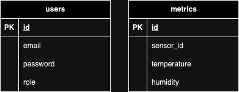

## Banco de dados

## Endpoints

#### Autenticação
Resource URI          | Método HTTP | Finalidade                | Cargo
--------------------- | ----------- | ------------------------- | -------
/auth/sign-up         | POST        | Registro de usuário       | -
/auth/sign-in         | POST        | Autenticação do usuário   | -

#### Métricas
Resource URI          | Método HTTP | Finalidade                | Cargo
--------------------- | ----------- | ------------------------- | -------
/metrics              | GET         | Listagem de métrica       | USER
/metrics              | POST        | Registro de métricas      | ADMIN
/metrics              | DEL         | Deletar todas as métricas | ADMIN

## Autenticação

Autenticação feita com JWT (RFC 7519) e hash de senha feito com bcrypt.